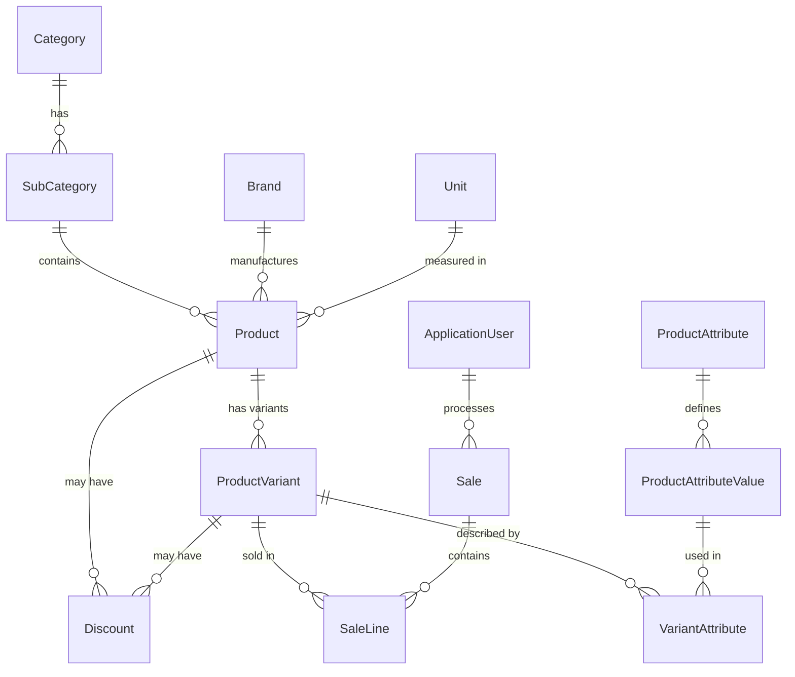

<p align="center">
  
  
  
  
  
</p>

# 🏪 POS System — Point of Sale Web Application

A full-featured **Point of Sale** system built with **ASP.NET Core MVC (.NET 9)**. Designed for retail environments, it provides a real-time cashier interface for processing sales, an admin dashboard for managing products and inventory, and a flexible discount engine — all backed by role-based access control.

> **Built by a team of 5 developers** as a course project at **ITI (Information Technology Institute)**.

---

## ✨ Key Features

| Module | Highlights |
|---|---|
| **🛒 Cashier POS** | Product browsing with search, filtering & pagination · Product variant selection (size, color, etc.) · Real-time cart management · One-click checkout with automatic receipt generation |
| **📊 Admin Dashboard** | Sales analytics & reporting · Inventory overview at a glance |
| **📦 Product Management** | Full CRUD for products, categories, subcategories & brands · Product variants with SKU tracking · Dynamic attributes (size, color) per subcategory · Image upload support |
| **💰 Discount Engine** | Product-level & variant-level discounts · Order-level discounts with spend thresholds · Fixed amount & percentage-based discount types · Expiration date support |
| **📈 Inventory Tracking** | Stock quantity per variant · Stock-level filtering (in stock / out of stock) · Automatic stock deduction on checkout |
| **🔐 Authentication** | ASP.NET Identity with role-based authorization · **Admin** and **Cashier** roles · Secure login with session management |

---

## 🏗️ Architecture & Design Patterns

```
POS_SYSTEM_MVC/
├── Areas/Admin/          # Admin panel (Dashboard, Products, Inventory, Discounts, Sales History)
├── Controllers/          # Cashier-facing controllers (POS, Account, Catalog management)
├── Models/               # Domain entities (Product, ProductVariant, Sale, SaleLine, Discount, etc.)
├── DTOs/                 # Data Transfer Objects for clean API contracts
├── Repositories/         # Generic & specialized data access repositories
├── Services/             # Business logic layer (10 service modules)
├── UnitOfWork/           # Unit of Work pattern for transactional consistency
├── ViewModels/           # View-specific data models
├── ViewComponents/       # Reusable UI components (e.g., sidebar categories)
├── Views/                # Razor views with partial views for AJAX-driven UI
├── Data/                 # EF Core DbContext, Fluent API config & database seeder
└── Constants/            # Enums, roles & seed data constants
```

**Patterns Used:**
- **Repository Pattern** — abstracts data access behind interfaces
- **Unit of Work** — ensures transactional integrity across repositories
- **Service Layer** — encapsulates business rules separate from controllers
- **DTO Pattern** — decouples API contracts from domain models
- **MVC Areas** — separates Admin and Cashier concerns

---

## 🗃️ Data Model



---

## 🛠️ Tech Stack

| Layer | Technology |
|---|---|
| **Framework** | ASP.NET Core MVC — .NET 9 |
| **ORM** | Entity Framework Core 9 (Code-First) |
| **Database** | Microsoft SQL Server |
| **Auth** | ASP.NET Core Identity (cookie-based, role-based) |
| **Frontend** | Razor Views, JavaScript (AJAX), CSS |
| **Architecture** | Repository + Unit of Work + Service Layer |

---

## 📄 License

This project was developed for educational purposes at **ITI (Information Technology Institute)**.
